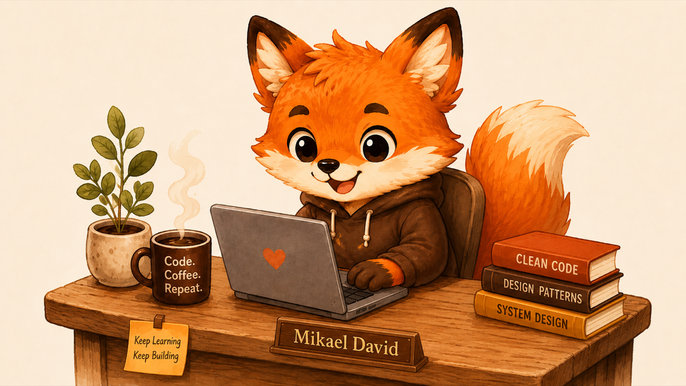

### Brazilian fullstack dev — building products solo, one cup at a time.  

---

##  Currently building

Six products in active development — most solo, all running in production or close to it.

| Product | What it does | Stack |
|---|---|---|
|  **[Repooor](https://github.com/MikaelDDavidd/repooor)** | Smart pantry tracker — 100% offline, no accounts | Flutter · Dart · sqflite |
|  **[OddNow](https://odd-now.com)** | Real-time sports betting odds comparison SaaS | NestJS · React · Playwright · PostgreSQL |
|  **[Inpify](https://github.com/MikaelDDavidd/coruja)** | SaaS for monitoring Brazilian INPI patent & trademark processes | NestJS · Flutter · Prisma · BullMQ |
|  **[Hatchling](https://github.com/MikaelDDavidd/hatchling)** | macOS menu-bar status panel for 17+ AI coding agents | Swift · SwiftUI · AppKit |
|  **[Stickers & Memes](https://github.com/MikaelDDavidd/stickers_and_memes)** | Published WhatsApp sticker & meme audio app | Flutter · GetX · NestJS API |
|  **[DASHO](https://github.com/MikaelDDavidd/dasho)** | Personal finance dashboard with AI receipt OCR | Flutter · GetX · NestJS |

---

##  Tech I work with

<table align="center">
  <tr>
    <td align="center" valign="top"><b>Mobile</b></td>
    <td align="center" valign="top"><b>Frontend</b></td>
    <td align="center" valign="top"><b>Backend</b></td>
    <td align="center" valign="top"><b>Data</b></td>
    <td align="center" valign="top"><b>DevOps</b></td>
  </tr>
  <tr>
    <td align="center" valign="top">
      
      
      
    </td>
    <td align="center" valign="top">
      
      
      
      
    </td>
    <td align="center" valign="top">
      
      
      
      
    </td>
    <td align="center" valign="top">
      
      
      
      
    </td>
    <td align="center" valign="top">
      
      
      
      
    </td>
  </tr>
</table>

---

##  GitHub stats

  

  

---

##  Open for freelance work

Building solo means I always have bandwidth for the right project — especially **Flutter apps**, **NestJS APIs**, and **Brazilian-market SaaS**.

&nbsp;

&nbsp;

---

> *"Building warm tools for real problems."*

Code. Coffee. Repeat. 

